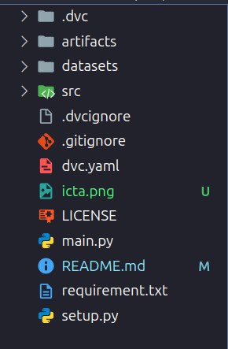

# An Automatic Machine Learning based Customer Segmentation Model with RFM Analysis


[Thai Hoc Nguyen*](https://nthaihoc.github.io/about-me/), [Xuan Thi Tran*](https://www.facebook.com/profile.php?id=100011111342596) (*equal contribution)

| [**PDF**](https://)
| [**BibTex**](https://scholar.googleusercontent.com/scholar.bib?q=info:jDDvSmlkNE0J:scholar.google.com/&output=citation&scisdr=ClGaGgM9ELX23GU65uo:AFWwaeYAAAAAZ9g8_up_MrLZJ0aQEKeamQuWVXQ&scisig=AFWwaeYAAAAAZ9g8_k384twAP8TFVEoPdVIHMvA&scisf=4&ct=citation&cd=-1&hl=vi) 
| [**Website**](https://books.google.com.vn/books?hl=vi&lr=&id=U7VNEQAAQBAJ&oi=fnd&pg=PA151&ots=nVD6xihs4e&sig=0ttGfynVgVQVw_Xn1QdzW0_babM&redir_esc=y#v=onepage&q&f=false) |


## Introduction
The focus of many companies is to provide the best products and services to attract attention in the market.Each customer has different preferences due to variations in age, gender, and other personal factors. Purchasing behavior is a significant indicator that helps determine customer's preferences. To achieve this, they must find the way to classify customers with similarities into segments. Customer segmentation based on their direct or indirect interaction behavior with the company can be challenging due to the difficulty in selecting key features that highlight the interactions.

RFM model that refers to the three key features of Recency, Frequency, and Monetary value has been considered as an effective technique to expose valuable insights of customers' behaviors. Some studies have addressed that applying the K-means algorithm combined with the RFM model can be a promisin solution for customer segmentation. 

With the continuous growth of generated data, it is crucial to deploy a machine learning based segmenting model in a Big data system. Hadoop and Spark are among best Big data storage and processing technologies. In this study, we propose an automatic, engaged machine learning based customer segmentation solution developed by Spark application framework while costumer data are stored in the HDFS storage. 


## Environment Setup

### Install Hadoop and Spark
First, you need to install Hadoop and Spark tools. Follow the installation instructions below:
- [Installing latest Hadoop 3.4 on Ubuntu 2024](https://medium.com/@nsidana123/installing-latest-hadoop-3-4-on-ubuntu-2024-easy-installation-guide-874f889fede7)
- [How to Install Spark on Ubuntu](https://medium.com/@redswitches/how-to-install-spark-on-ubuntu-965266d290d6)
 
### Create environment
Create virtual environments to ensure that libraries between applications do not conflict.You can create virtual environments anywhere you want. Using `python` for Window or `python3` for Linux.

```bash
$ python3 -m venv demo-project
$ cd demo-project
$ source bin/activate
```
### Download Source Code
Download repo from github to local using command:

```bash
$ git clone https://github.com/nthaihoc/rfm-segmentation-ml.git
```

### Install Library Dependencies 

You need to install the necessary libraries to manage and run the application. Using `pip` for Window or `pip3` for Linux.

```bash
$ cd rfm-segmentation-ml
$ pip3 install -r requirements.txt
```

### Folder Structure

There are some important files as `artifacts`, `src` and `dvc.yaml`.

+ `artifact` include model and results file
+ `src` include source code of application
+ `dvc.yaml` is a configuration file, supporting automatic command line execution, for building and managing pipelines

See more information about [`dvc`](https://dvc.org/)

<div style="text-align: center;">
    
</div>

### PipeLine Start

After successfully installing all the above steps, run the following command to start testing the application.

```bash
$ dvc repro
```

## Contributing
For any feedback or comments, please feel free to contact me through the following information [**thaihoc.ictu@gmail.com**](mailto:thaihoc.ictu@gmail.com)

## Citation
```bash
@inproceedings{xuan2024automatic,
  title={An Automatic Machine Learning Based Customer Segmentation Model with RFM Analysis},
  author={Xuan, Tran Thi and Hoc, Nguyen Thai},
  booktitle={Advances in Information and Communication Technology: Proceedings of the 3rd International Conference ICTA 2024},
  pages={151},
  organization={Springer Nature}
}
```

